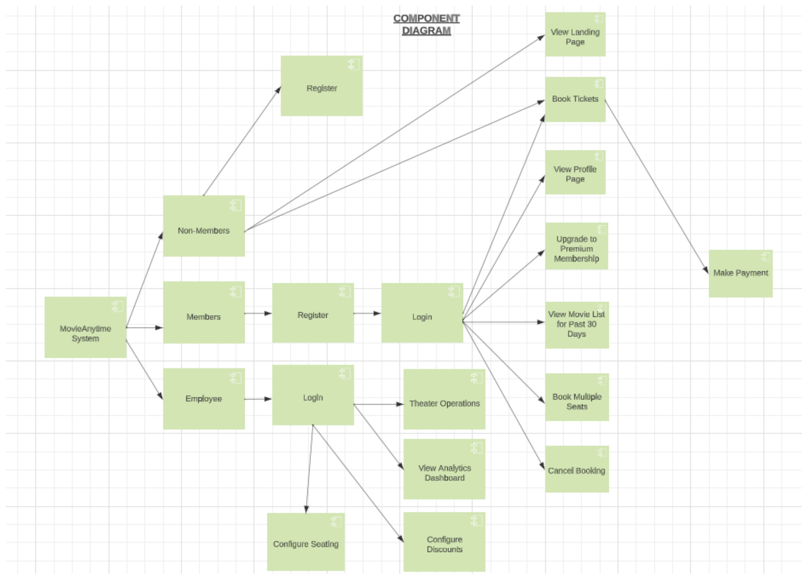

# Team 6 CMPE 202 Project Fall 2023

## Team Members: Aishwarya Shankar, Sai Pranavi Kurapati, Sayali Vinod Bayaskar, Divija Choudhary
---
### Name of Application: MovieAnytime
GitHub Project Repo Link: [https://github.com/gopinathsjsu/team-project-team6-1]  
Project Board Link:\
Project Journal Link: https://github.com/gopinathsjsu/team-project-team6-1/tree/main/Project_Journal  
Google Sprint Task Sheet Link:  

### Tech Stack Used
+ Frontend: HTML, CSS, JavaScript
+ Backend: Python Flask Framework
+ Database: PostgreSQL

Rationale behind tech stack decision: Since we are dealing with structured data for this this application, a relational database made sense to use. Most team members were overall familar with PostgreSQL, so we chose to use that. Team members were also familiar with Python programming, and Flask framework makes it easy to create routes/endpoints so we decided to use this for backend. Our team decided to use HTML, CSS, and JavaScript for the frontend as we had not extensively worked with any frontend frameworks prior to this project, so we decided to keep it simple. 
### Feature Set of MovieAnytime:
+ UI accessible by 3 different roles (members, non-members, and employees)
+ All users can:\
View home/landing page which has information on theater, locations, movie schedule, and upcoming movies\
Register/signup as a regular member\
Book tickets for a movie
+ Registered members can:\
View their profile page\
Upgrade to premium membership\
View their past 30-day movies watched list\
Book up to 8 seats for a movie showing\
Cancel their upcoming movie booking and get a refund\
Accumulate reward points (1 point per dollar spent)\
Premium members don't have to pay online service fee for booking\
+ Theater employees can:\
Add, update, and remove movies, showtimes, and theater assignments in the schedule\
Configure seating capacity for a theater in a multiplex\
View analytics for theater occupancy in the past 30/60/90 days summarized by location and by movies\
Configure discount prices for Tuesday movie showings or showings before 6 PM    

## Diagrams  
### Component Diagram  

### Architecture Diagram  

### Deployment Diagram  
We've deployed our application and database on AWS. We have 2 EC2 instances serving as our web servers, and a load balancer configured on top of these 2 instances. Our PostgreSQL database is set up in RDS in an auto-scale group. 

## Contributions  
### Aishwarya Shankar  

- Created UI Wireframes for landing page, booking tickets page, and payment page
- Helped design Postgres database schema and populated it with mock data for some tables
- Performed research on tech stack and got up to speed with Python, Flask, and Postgres
- Was Scrum Master for one sprint
- Backend development contributions using Python/Flask:  
wrote user registration/signup API which also allows them to register and obtain immediate Regular membership  
wrote API for users to upgrade to Premium membership  
wrote API to fetch user's profile information to display on membership page  
wrote API to get user's past movie booking history  
wrote API to get user's upcoming movie bookings  
wrote API to get user's movies watched in the past 30 days  
wrote API for user to cancel their upcoming movie booking and get refund  
wrote some helper APIs to get information relevant to employees like multiplexes by location, all cities in db, and movies played in the past 90 days  
wrote API for employees to get theater occupancy analytics for the last 30, 60, and 90 days summarized by locations  
wrote API for employees to get theater occupancy analytics for the last 30, 60, and 90 days summarized by movies  
wrote api for employees to be able to configure discount prices for Tuesday movie showings or showings before 6 PM  
- Wrote team's XP Core Values Reflection
- Setup team's AWS account
- Worked on setting up PostgreSQL database instance in AWS RDS  
- Worked with Sayali to set up load balancer for servers in AWS
- Helped troubleshoot some issues in AWS deployment of application
- Created component diagram, architecture diagram, and deployment diagram
- Wrote the project README.md file  
- Participated in project presentation/demo

### Sayali Vinod Bayaskar  

### Sai Pranavi Kurapati  

### Divija Choudhary 

Created UI Wireframes for admin landing page, cancel tickets, and membership page
Prepared mock data for postgresDB
Was Scrum Master for one sprint
Frontend development contributions using Html/CSS:
Designed common landing page for all types of users
Given two directives for 
- all current movies
-all upcoming movies.
Designed user registration/signup frontend and added validations to it.
Integrated API and UI for users to upgrade to Premium membership.
Integrated user profile details to a common profile page
- Profile(General)
- View Past Bookings
- View Upcoming bookings
- View movies watched in past 30 days

Designed module for cancel their upcoming movie booking and get refund.
Designed UI for admin anlytics dashboard
- summarized by location
- summarized by movie
Integrated all the UI components and analyzed whole flow.
Researched over the deployment process
Configured global IP for the connection establishment on the ec2
Setup the ec2 instance, made sure to have all the project files on the ec2 instance.
Handled deployment for whole project

